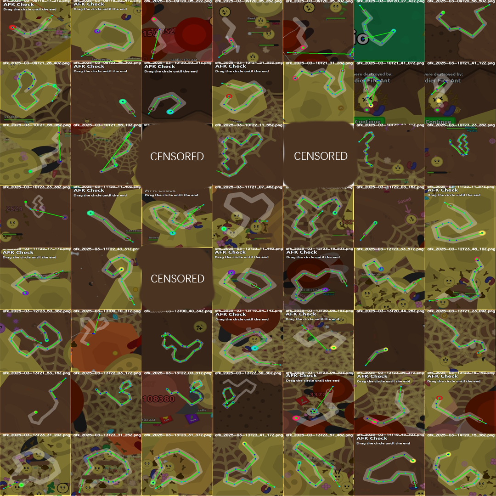
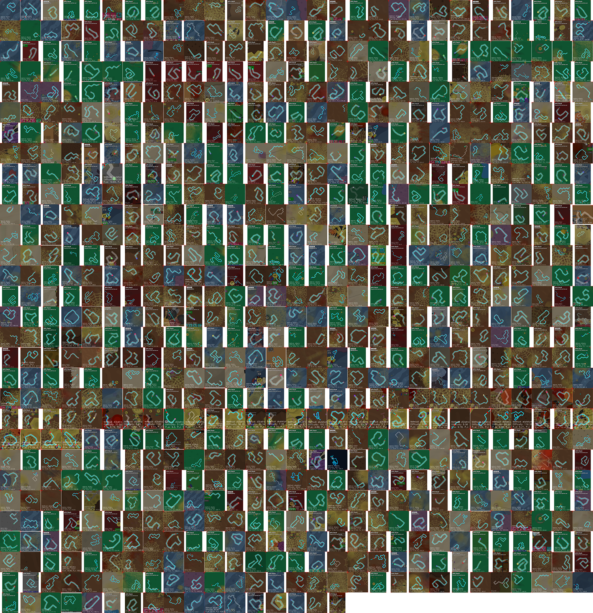
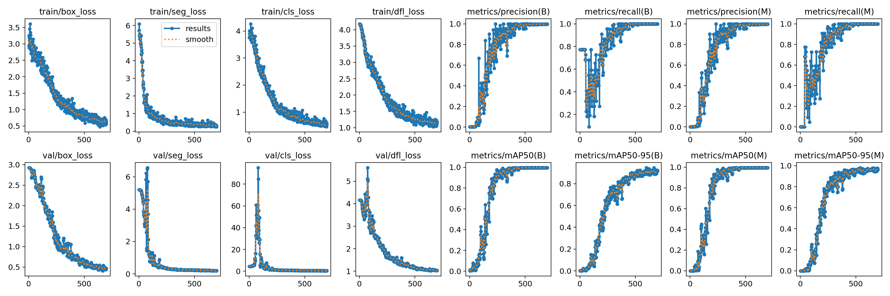
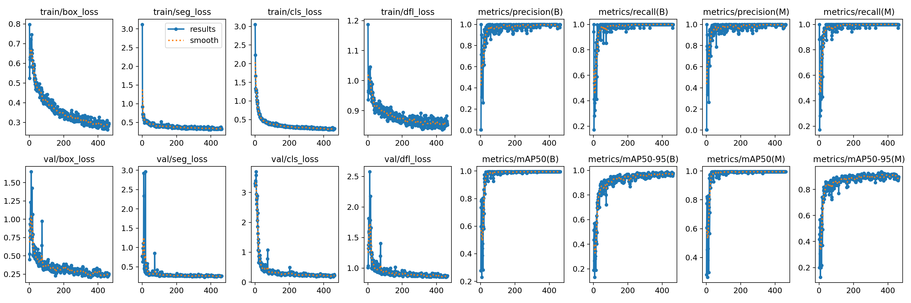

# florr auto afk (v1.2.8) (2025-05-27 Update)

   

Web Page: https://shiny-ladybug.github.io

> As m28 released his new anti afk, I‘ll put my new anti-anti afk code here.

> [!CAUTION]
>
> M28 can send player messages and AFK Checks. If you can solve the check but cannot respond to his messages, it may result in a BAN.

## How to Use

### Executables

A cat told me that somehow he can't understand this README document. So I decided to fix it. I figured I should explain how to USE it.

Go to [RELEASE](https://github.com/Shiny-Ladybug/florr-auto-afk/releases) and click the blue stuff that says `florr-auto-afk-v1.*.*.zip`.

Then you can unzip it, put it anywhere you want, and then run the `segment.exe` file.

### Deploy

If you want the source code as well as the `exe` file, you might want to choose this option.

Firstly, go to whatever location you want this project to be and run `cmd` in it. Then run the command below to clone this repository:

```bash
git clone https://github.com/Shiny-Ladybug/florr-auto-afk
```

After successfully cloning this repository, run the code below to install the necessary dependencies:

```bash
pip install -r ./py311-requirements.txt
```

Now you can run the code:

```bash
python segment.py
```

For the latest v1.2.x, you need **WINDOWS** device to run.

Also, the release version is only for **WINDOWS** and **CPU ONLY** users.

If you want to run the script on MacOS or Linux, then sadly, you can only use v1.1.1.

By the way, you can build your own GPU version here by installing `torch-gpu`.

## Config

See the settings page in the GUI menu. In the config, you can tweak parameters to what you like.

If you are Chinese by accident and can't understand what this is, set `language` to `zh-cn` for Chinese settings.

Some cats still weren't satisfied with this and want explicit explanations for how everything in the setting works.

Now you can go to [Settings.md](./Settings.md) to learn about all that stuff.

Oh, and by the way, people didn't even notice that hovering above the config choices gives more details.

## INFO

In the latest v1.2.x version, I added background AFK Check detection support. This requires that your browser supports disabling `CalculateNativeWinOcclusion`.

Details are below:

### Chrome

Go to `chrome://flags/` and search for `CalculateNativeWinOcclusion`. If this appears, go `disable` it.

If you can't find the element, try running this and replace the `chrome.exe` path if needed.

```shell
"C:\Program Files\Google\Chrome\Application\chrome.exe" --disable-features=CalculateNativeWinOcclusion
```

### Edge (Not Supported)

> ~~I didn't find a method to disable the feature, however, I found this in `Edge Beta`, `Edge Dev`, and `Edge Canary`, check the Insider Edge version at https://www.microsoft.com/en-us/edge/download/insider~~
>
> ~~Hence, you should install one of `Edge Beta`, `Edge Dev`, or `Edge Canary`.~~
>
> ~~After you install the Insider version, go to `edge://flags/` and disable `CalculateNativeWinOcclusion` (essentially the same as what you do for Chrome).~~

I find there is no sight of disabling `CalculateNativeWinOcclusion`  on 05/27/2025. Both Edge Beta (137.0.3296.39) and Edge Canary (137.0.3283.0) cannot disable the feature any longer.

So I announce that Edge is **End of Support** now.

### Firefox

Congratulations, Firefox disables `CalculateNativeWinOcclusion` by default, enjoy your game in Firefox.

## Note

I have opened-sourced the code here.

If you want to use our models to write more automation code, go check the models in [assets](https://github.com/Shiny-Ladybug/assets)

If you want to boot this without an `Internet Connection`, try to set `skipUpdate` in `config.json` to `true`.

P.S. Sidenote: After trying the ONNX models, I think it's the worst decision I have ever made.

Now those stupid codes go under the `onnx` branch.

## Changelog

* 2025-05-11

  Fix starting point issue, update GUI and change the notify mp3 audio, notify and press 'ready' when server close or afk fail
* 2025-05-04

  If you turn on SaveTrainableDataset in Settings > Advanced, program will save the dataset to `./train` folder, I'm welcomed to receive those datasets to improve the AFK model
* 2025-04-26

  Add background AFK Check detection support
* 2025-04-18

  Add GUI, exposure, idle detection support

  As that exposure can nerf the mobs' movement effect and idle detection enables me to active (maybe kill supers) without quitting the program

  

## Gallery

Old model was trained on `4/30/2025` based on 107 instances with 698 epochs.

New model was trained on `5/23/2025` based on 225 instances (192 train, 33 val) with 431 epochs.

<center>
<figure>

·
·
·

</figure>
</center>





## Difficulty

I do rank those AFK Checks so that I can do sorts easily

$$
D = \sqrt{ \max\left(1, 3 * P_{density}\right) \cdot \left( \frac{P_{l}}{P_{w}} \right) \cdot \sqrt{N_{p}} }
$$

The density using `KDTree` to count the neighbor points

## How it works

1. Use `afk-det.pt` model to detect the AFK Check windows.

   The model contains 3 classes: `AFK_Window`, `Start`, `End`

   Model most recent updated on `4/30/2025`

   Training for 632 epochs based on 107 instances.
2. Try to use the YOLO model `afk-seg`.pt to separate the AFK Path.

   Detailed Model Information go check [Model Gallery](##Gallery).
3. Use the `cv2.ximgproc.thinning()` method to get the skeletonized path.
4. Loop

## FAQ

Q: Why can't I clone or download this repository?

A: Man, what can I say? Skill issue.

Q: Why can't the GUI load properly?

A: You are probably too anxious. Be patient. It takes 10s to initialize on my computer and might take several minutes on your sloth-speed computer.

Q: What is the accuracy of this model?

A: According to statistics, after properly installing the newest version of Auto AFK, the accuracy should be greater than **90%**.

Q: Why is the accuracy tested on my computer so low?

A: Most likely skill issue. Make sure you are NOT using normal Edge (mentioned above). Also make sure you have disabled `CalculateNativeWinOcclusion` if you're on Google Chrome or other versions of Edge.

Q: Why is my computer so hot when running the code?

A: Make sure you close all the unnecessary programs when running and maybe turn on "Best Battery Life".

Q: But my computer goes to sleep after a very short period. How to fix that?

A: Go to Settings in your computer and change the sleep after inactive time, of course.

Q: I found some bugs/I have some ideas for improving this application. What should I do?

A: Suggest turning on `Save Trainable Dataset` in Settings > Advanced. Then contact Shiny Ladybug via QQ.

## Issues

**I DO NOT RECOMMEND TRUSTING THIS SCRIPT**

It can pass some AFK Checks.

The longer you stay in the same server, the AFK checks get harder.

The script cannot solve the ***WORM-LIKE*** disgusting checks for the time being.

## ?


Some people queried why I was using GPLv3 without opensourcing.

BRO, that night was **TRADITIONAL CHINESE NEW YEAR'S EVE**, can't I just upload the release code and have a break at this good time. Or you can read the release notes carefully, word by word, and you can find the problem.
