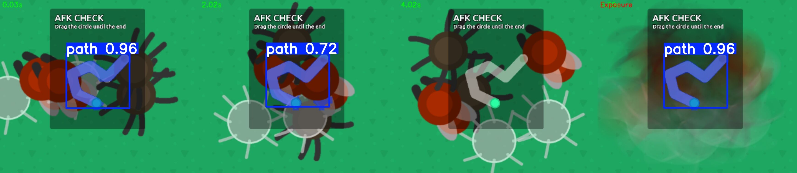
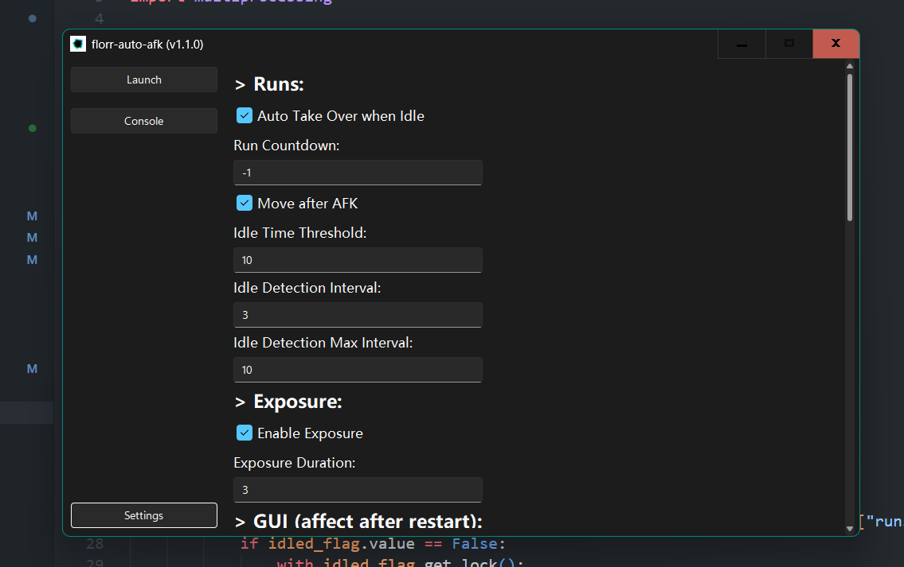
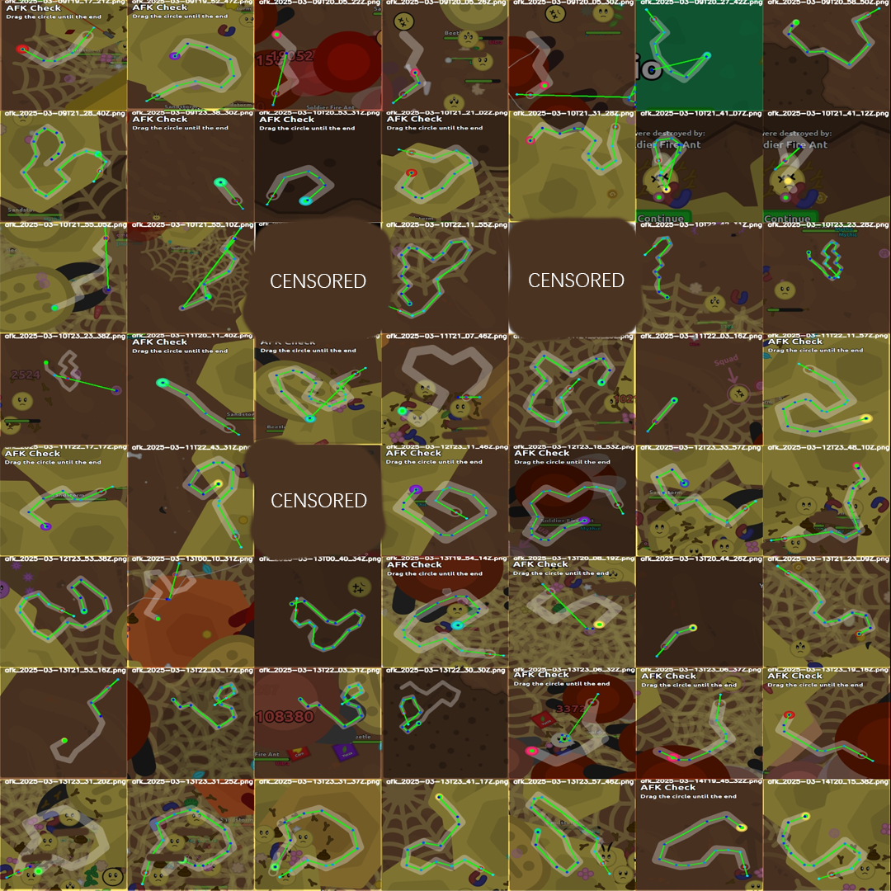
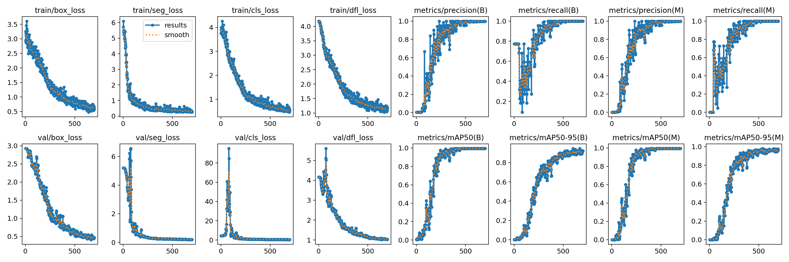
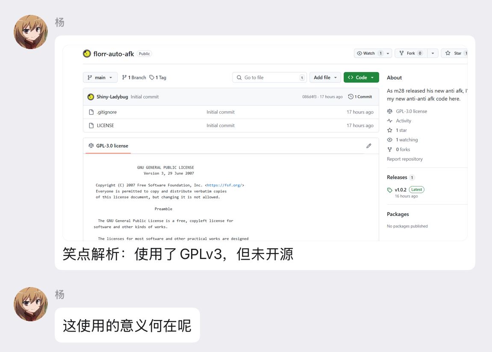

# florr auto afk (v1.2.2) (2025-05-01 Final Update)

> As m28 released his new anti afk, I‘ll put my new anti-anti afk code here.

> [!CAUTION]
> On 2025/02/07, m28 nerfed egg and increase the difficulty of AFK Checks, however, keep using this script may result in a BAN
>
> M28 also can send player messages and AFK Checks, if you can solve the check but cannot respond to his messages, you may result in a BAN

## INFO

For the latest v1.2.x , you need **WINDOWS** device to run, or you can only use v1.1.1.

After trying the onnx models, I think it's the worst decision I have ever made.

Now those stupid codes go under the `onnx` branch

Latest v1.2.x version, I added background AFK Check detection support, this requires your browser supports disabling

`CalculateNativeWinOcclusion` or try to use [Firefox](https://www.mozilla.org/en-US/firefox) browser

### Chrome

Go to `chrome://flags/` and search for `CalculateNativeWinOcclusion` if this appears go `disable` it

If you can't find the element, try run this and replace the `chrome.exe` path if needed

```shell
"C:\Program Files\Google\Chrome\Application\chrome.exe" --disable-features=CalculateNativeWinOcclusion
```

### Edge

I didn't find a method to disable the future, however, I found this in `Edge Beta` , `Edge Dev` and `Edge Canary`, check the Insider Edge version at https://www.microsoft.com/en-us/edge/download/insider

After you install the Insider version, go to `edge://flags/`  and do the same thing as **Chrome** does

### Firefox

Congratulations, Firefox disable  `CalculateNativeWinOcclusion` by default, enjoy your game in Firefox

## Note

I have opensourced the code here.

If you want to write more automation codes, go check models in [assets](https://github.com/Shiny-Ladybug/assets)

If you want to boot this without an `Internet Connection`, try to set `skipUpdate` in `config.json` to `true`.

## Changelog

* 2025-04-26

  Add background AFK Check detection support
* 2025-04-18

  Add GUI, exposure, idle detection support

  As that exposure can nerf the mobs' movement effect and idle detection enables me to active (maybe kill supers) without quitting the program

  

  

## Deploy Locally

```bash
pip install -r ./py311-requirements.txt
python segment.py
```

Notice: the release version is only for **WINDOWS** and **CPU ONLY** users.

If you want to run the script on MacOS or Linux, go to run source codes.

You can build your own GPU version here by installing `torch-gpu`.

## Config

See the settings page in GUI menu.

If you can't understand and you are Chinese, set `language` to `zh-cn` for Chinese settings.

## Gallery



## How it works

1. Use PaddleOCR to detect if the screen contains "AFK Check" (deprecated as m28 could send a window contain no "AFK Check" text)

   OCR model using `ch_pp_ocrv3`

   I know that I can use a tampermonkey script which rewrites the `canvas.FillText`

   ```js
   function rewriteFillText() {
           function getCompatibleCanvas() {
               if (typeof (OffscreenCanvasRenderingContext2D) == 'undefined') {
                   return [CanvasRenderingContext2D]
               }
               return [OffscreenCanvasRenderingContext2D, CanvasRenderingContext2D];
           }
           const idSymbol = Symbol('id');
           for (const {prototype} of getCompatibleCanvas()) {
               prototype[idSymbol] = prototype.fillText
           }
           for (const {prototype} of getCompatibleCanvas()) {
               prototype.fillText = function (text, x, y) {
                   // DO SOMETHING NASTY
                   return this[idSymbol](text, x, y);
               }
               prototype.fillText.toString = () => 'function toString() { [native code] }';
           }

       }
   ```

   I can start a local HTTP API to see if i got checked.

   For specified reasons, I do not recommend using internal scripts (for unknown BAN results). I'd like doing all these tasks by Python.

   So I used a YOLO model `afk-det.pt` to detect the AFK Check windows.
2. Trying using yolo model `afk-seg`.pt to separate the mouse path.

   

   Obviously i got a good model for this.

   After I get the contours, we can use the `cv2.ximgproc.thinning()` method to get the skeletonized path.
3. Sometimes the yolo model cannot detect the possible results.

   I use opencv as well to detect the path.

   By using the Grey Style, we can define a specific `lower_bounds` and `upper_bounds` to get the path.
4. Loop

## Issues

**I DO NOT RECOMMEND TRUSTING THIS SCRIPT**

It can really passing some easy AFK checks.

As the longer you stay in the same server, the checks get harder.

The script cannot solve the ***WORM-LIKE*** disgusting checks for the time being.

I'll improve the code soon.

## ?



Some people queried why I was using GPLv3 without opensourcing.

BRO,that night was **TRADITIONAL CHINESE NEW YEAR's EVE**, can't I just upload the release code and have a break at this good time. Or you can read the release notes carefully words by words and you can find the problem.
