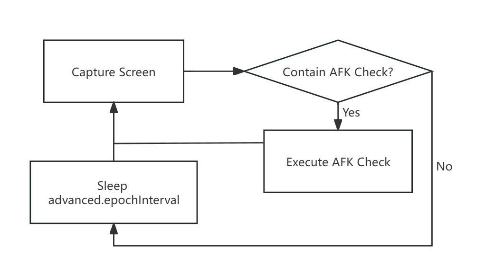

# Settings

## Parameters

1. [Runs](#runs)
2. [Exposure](#exposure)
3. [GUI](#gui)
4. [Advanced](#advanced)
5. [Execute Binary](#execute-binary)
6. [YOLO Config](#yolo-config)

---

### Runs
Configuration for core program operations

| Parameter | Type | Default | Description |
|-----------|------|---------|-------------|
| `autoTakeOverWhenIdle` | Boolean | `false` | Automatically bypass AFK detection when user is idle for `idleTimeThreshold` seconds |
| `runningCountDown` | Integer | `-1` | Program auto-closes after X minutes (`-1` = infinite) |
| `moveAfterAFK` | Boolean | `true` | Perform small WASD movement after AFK bypass to prevent movement checks |
| `idleTimeThreshold` | Integer | `10` | Idle detection threshold (seconds) |
| `idleDetInterval` | Integer | `3` | Initial idle detection interval (seconds) |
| `idleDetIntervalMax` | Integer | `10` | Maximum idle detection interval (seconds) |
| `notify` | Boolean | `true` | Show notification when AFK detected |
| `sound` | Boolean | `true` | Play sound when AFK detected |
| `soundPath` | String | `./gui/notify.mp3` | Path to notification sound file |

---

### Exposure
Anti-background interference settings

| Parameter | Type | Default | Description |
|-----------|------|---------|-------------|
| `enable` | Boolean | `true` | Enable exposure control |
| `moveInterval` | Float | `0.25` | Lateral movement interval during exposure (0 = disable) |
| `duration` | Integer | `3` | Total exposure duration (seconds) |

---

### GUI
Interface settings (requires restart)

| Parameter | Type | Default | Description |
|-----------|------|---------|-------------|
| `language` | String | `en-us` | Interface language (`zh-cn`/`en-us`) |
| `theme` | String | `auto` | Color scheme (`dark`/`light`/`auto`) |

---

### Advanced
Expert-level configurations

| Parameter | Type | Default | Description |
|-----------|------|---------|-------------|
| `saveTrainData` | Boolean | `true` | Save trainable dataset to `./train` |
| `moveMouse` | Boolean | `true` | Enable mouse movement |
| `useOBS` | Boolean | `false` | OBS recording control (hotkeys: Ctrl+Alt+Shift+O/P) |
| `verbose` | Boolean | `true` | Detailed logging |
| `epochInterval` | Integer | `8` | Detection cycle interval (reduce for faster checks) |
| `optimizeQuantization` | Integer | `1` | Path optimization level (higher = faster but less precise) |
| `rdpEpsilon` | Integer | `5` | Mouse path smoothness (lower = smoother but slower) |
| `saveImage` | Boolean | `true` | Save AFK screenshots |
| `saveYOLOImage` | Boolean | `true` | Save YOLO prediction images |
| `extendLength` | Integer | `30` | Path extension length |
| `mouseSpeed` | Integer | `100` | Mouse movement speed |
| `skipUpdate` | Boolean | `true` | Disable automatic updates |
| `environment` | Boolean | `true` | Environment status flag |
| `debug` | Boolean | `false` | Enable debug logging |
| `windowSizeTolerance` | Float | `0.1` | Window size detection tolerance |
| `windowSizeRatio` | Array | `[0.787, 1]` | AFK window size ratio filter |

**Note:** Avoid opening **superping** to prevent screenshot clutter.

---

### Execute Binary
External command execution

| Parameter | Type | Default | Description |
|-----------|------|---------|-------------|
| `runBeforeAFK` | String | `""` | Path of executables to execute before AFK bypassed |
| `runAfterAFK` | String | `""` | Path of executables to execute after AFK bypassed |

---

### YOLO Config
Model configuration

| Parameter | Type | Default | Description |
|-----------|------|---------|-------------|
| `segModel` | String | `./models/afk-seg.pt` | Segmentation model path |
| `detModel` | String | `./models/afk-det.pt` | Detection model path |

## Some Explanations

### Run Interval

